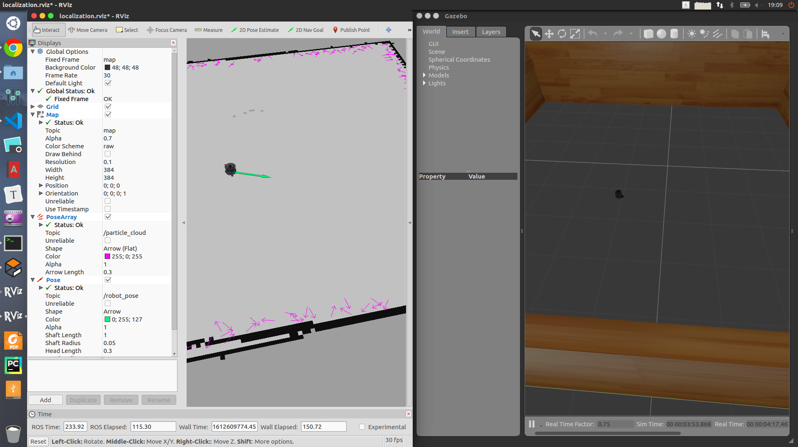

# 移动机器人蒙特卡洛定位和目标点发布与导航

* Turtlebot3的Model需要进行固定`export TURTLEBOT3_MODEL=burger`

* 移动机器人的地图可以自己修改，并通过matlab将pgm格式的图片 转换成矩阵形式并以`dat`格式的文件进行保存。

* 在蒙特卡罗模拟的包中需要对全局变量的格式进行修改

  ```xml
  <node name="pf_localization" pkg="pf_localization"  type="localization_node" output="screen" >
  	<param name="package_path_param" type="string" value="/home/hemingshan/robot-localisation/src/" />
  </node>
  ```

  

## turtlebot3 文件夹

  该文件夹是所有`turtlebot3`的安装包，包括了模型文件和运行文件，我在其中的`launch`文件中修改了地图地址，也就是自己创建的地址修改到了文件中，这样就可以运行时的环境是自己随意创建的。

## navigation 文件夹

  该文件夹是在大三上学期学习`ROS`课程时，研究生学长为了帮助我们更好的深入学习该操作系统，并锻炼我们的`c++`编程水平而自主设计的导航实验，其中在`launch`文件夹主要有三个文件，分别对应的是

* 在终端上输入目标点的位置和姿态，turtlebot3将在导航包的算法下导航到目标点
* 通过程序获取`landmarks.txt`下的一系列目标点，并依次导航到每个目标点位置
* 将简单通过运行turtlebot3的launch文件来运行Gazebo环境下的机器人，以便后续通过键盘控制和蒙特卡洛定位

## mc_localization

  在这个文件夹中主要通过`lanch`文件来运行所有编好的程序，主要思路在机器人位置未知的情况下，对机器人里程计和激光雷达数据的获取来完成蒙特卡洛算法的定位。其中对于数据的获取，主要有两种方式，一种是通过`log`的形式，也就是将之前跑好的数据记录下来，在回到程序中仿真，另一种是通过`advertise`的形式，也就是`ROS`系统中的定位形式。两者的差别如下：

* `log`形式的优点是：计算速度快; 缺点是：毫无实时性可言
* `advertise`形式的优点是：实时性较好; 确定是：由于计算量和订阅发布机制导致的运算速度下降，导致实时性也变差

  所以这个包需要改进的地方还有很多，但是是一个对于蒙特卡洛算法入门非常好的包，通过学习会在其他方面应用。下面以图进行展示。

| 学长完成的地图和`log`数据格式下的仿真 |               我在订阅发布机制上完成的实时计算               |
| :-----------------------------------: | :----------------------------------------------------------: |
|       |  |

  左面的动图是有很好的效果，说明在该算法在计算准确度上有很高的`performance`，但是惟一的缺点就是实时性。在右边的结果上来看，实时性具备了，但是计算速度有很大的下滑，所以整个包的优化还是很有必要的。